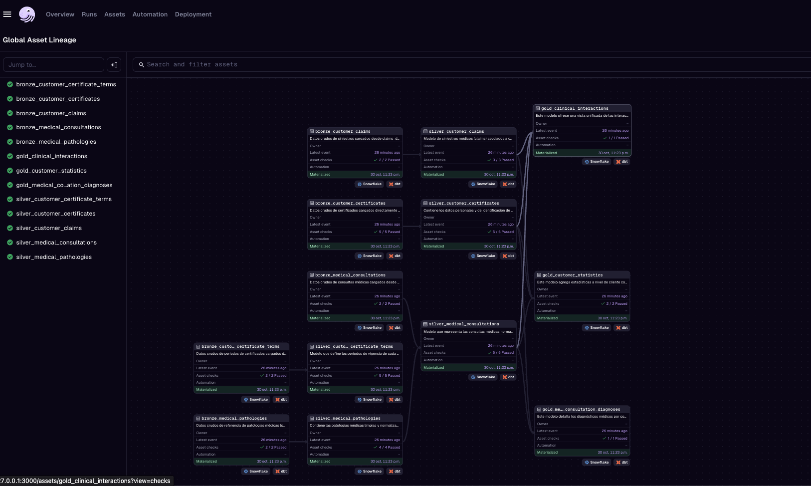

# koltin_challenge

Bien pues esta es la solucion que propongo al challenge!
Muchas gracias por la oportunidad de participar en el proceso de selección.

### Video

<video src="media/intro.mp4" controls width="600"></video>


### Estructura del proyecto
El proyecto está estructurado en 3 capas: bronze, silver y gold.
- **Bronze**: Carga de datos en bruto desde los archivos CSV proporcionados.
- **Silver**: Limpieza y transformación de los datos para asegurar su calidad e integridad
- **Gold**: Modelos analíticos y de negocio listos para su consumo.

### Instrucciones para ejecutar el proyecto
1. Clona el repositorio:
   ```bash
   git clone https://github.com/ingoscarn/koltin-challenge.git
    cd koltin-challenge
    ``` 

2. Instala las dependencias de dbt:
    ```bash
    uv add dbt-core dbt-snowflake
    ``` 

3. Instala dagster y las dependencias necesarias:
    ```bash
    uv add dagster dagster-dbt
    ``` 

4. Pega el archivo profile.yml en la carpeta ~/.dbt/ para configurar la conexión a Snowflake en
  ```bash
  dbt/koltin/profiles.yml
```

5. Ejecuta el ui de dagster:
    ```bash
    dagster dev
    ```


### Visualización del lineage con Dagster




